### Descripción del problema
### Nombre del problema: Tower Defense

Descripción: El juego es un juego de defensa de torres donde el jugador debe defender su base de
oleadas de enemigos colocando torres en lugares estratégicos del mapa.

## Clases principales:
- Game: Clase principal que maneja la lógica del juego.
- Map: Representa el mapa del juego.
- Enemy: Clase base para todos los enemigos.
- Tower: Clase base para todas las torres.
- Wave: Maneja las oleadas de enemigos.
- Player: Representa al jugador y sus estadísticas.
### Flujo del juego
1. Inicialización:
   - Se inicializa el mapa, el jugador y la primera oleada de enemigos.
2. Colocación de torres:
   - El jugador coloca torres en el mapa.
3. Inicio de oleadas:
   - El jugador inicia una oleada y los enemigos comienzan a moverse hacia la base.
4. Ataque de torres:
   - Las torres atacan a los enemigos dentro de su alcance.
5. Actualización del estado:
   - Se actualiza el estado del juego: se verifican las vidas de los enemigos, se calcula la puntuación y la salud de la base.
6. Finalización de oleada:
   - Al finalizar una oleada, el jugador puede colocar nuevas torres o mejorar las existentes antes de iniciar la siguiente oleada.
7. Fin del juego:
   - El juego termina si la salud de la base llega a cero.

   Para guiarme usare este boceto de diagrama hecho rapidamente:

   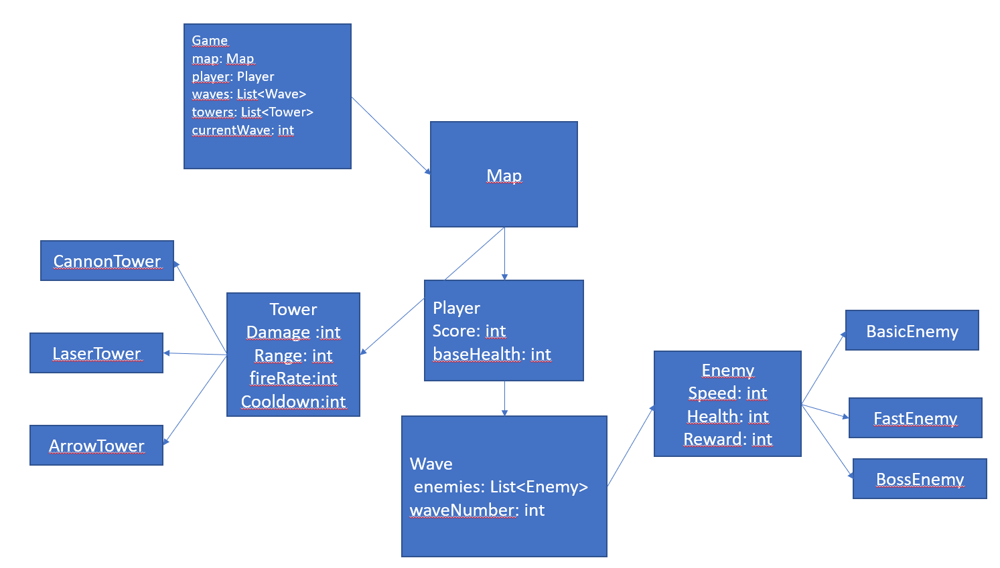

   ### Implementacion:
Expliare rapidamente cada clase immplmentada(basada en la implementacion presentada por el profesor)

#### Map: 

 Representa el mapa del juego, donde se define el escenario, los caminos de los enemigos, las posiciones disponibles para las torres y la base.

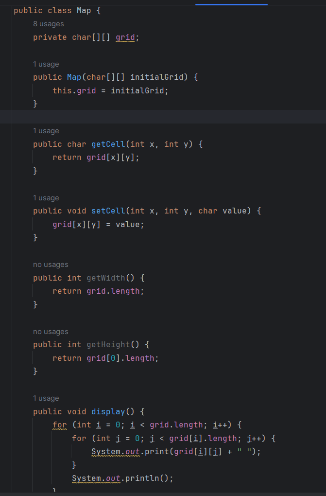
Atributos:
- grid: Una matriz bidimensional (char[][]) que define el estado del mapa.

Métodos:
- getCell(int x, int y): Devuelve el valor de una celda específica.
- setCell(int x, int y, char value): Establece el valor de una celda específica.
- getWidth(): Devuelve el ancho del mapa.
- getHeight(): Devuelve el alto del mapa.
- display(): Muestra el mapa en la consola.

#### Enemy: 

Representa a los enemigos que se desplazan por el mapa.

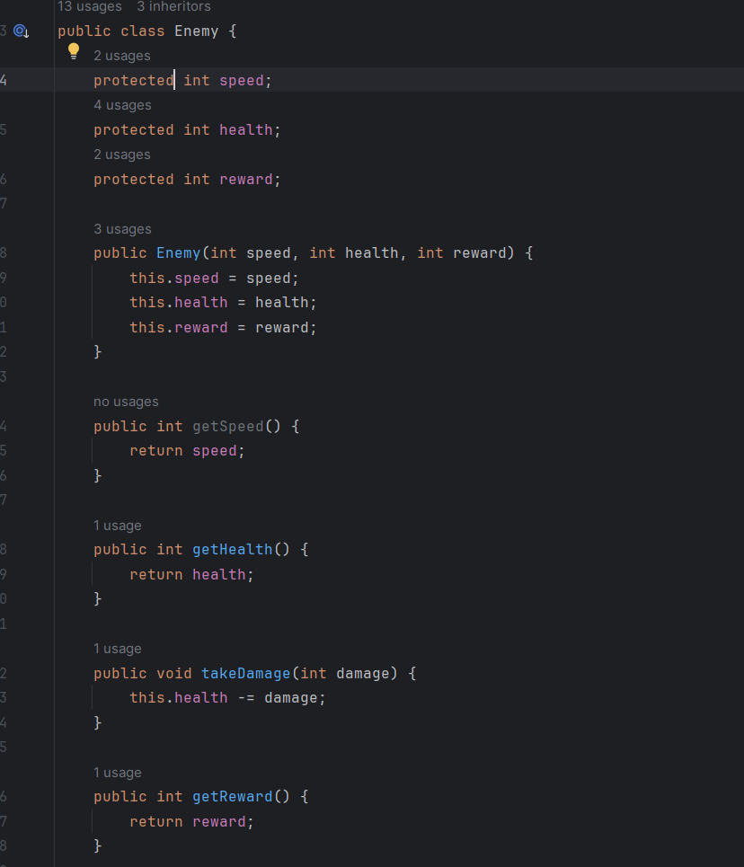
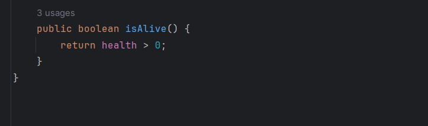

Atributos:
- speed: Número de celdas que el enemigo se mueve por turno.
- health: Cantidad de vida del enemigo.
- reward: Recompensa que el jugador obtiene al derrotar al enemigo.

Métodos:
- getSpeed(): Devuelve la velocidad del enemigo.
- getHealth(): Devuelve la vida del enemigo.
- takeDamage(int damage): Reduce la vida del enemigo por la cantidad de daño recibido.
- getReward(): Devuelve la recompensa del enemigo.
- isAlive(): Verifica si el enemigo está vivo.

Sub clases de enemy:

BasicEnemy: Enemigo básico, lento y con poca vida.

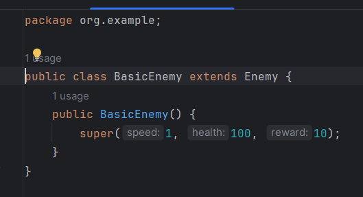

FastEnemy: Enemigo rápido, con menos vida.

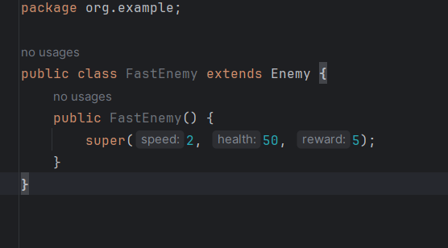

BossEnemy: Jefe, lento, con mucha vida y mayor recompensa.

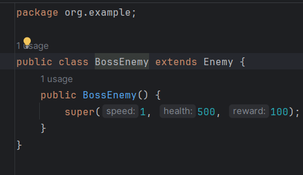

#### Tower: 
Representa las torres que el jugador puede colocar en el mapa para atacar a los enemigos.

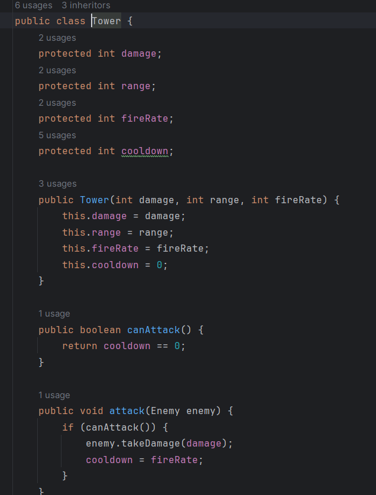
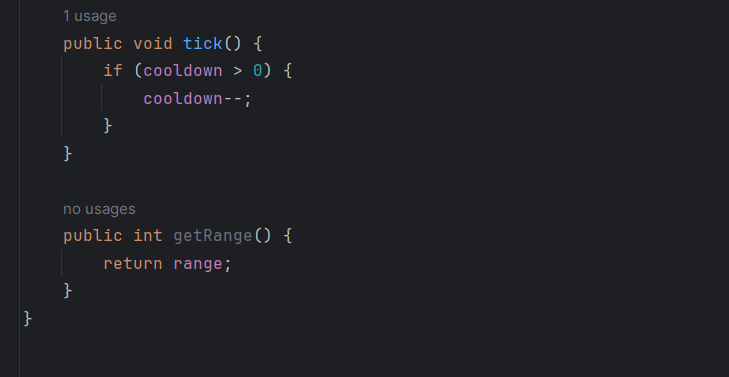

Atributos:
- damage: Cantidad de daño que inflige la torre a los enemigos.
- range: Número de celdas a las que puede atacar desde su posición.
- fireRate: Frecuencia de disparo de la torre (turnos entre disparos).
- cooldown: Temporizador que determina cuándo la torre puede disparar nuevamente.

Métodos:
- canAttack(): Verifica si la torre puede atacar.
- attack(Enemy enemy): Ataca a un enemigo, reduciendo su vida.
- tick(): Actualiza el estado de la torre, decrementando el cooldown si es necesario.
- getRange(): Devuelve el alcance de la torre

Subclases de Tower:

CannonTower: Torre con alto daño y corto alcance.

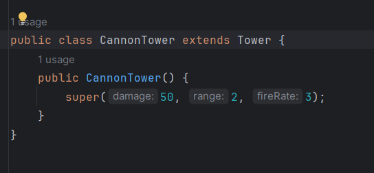

LaserTower: Torre con daño moderado y largo alcance.

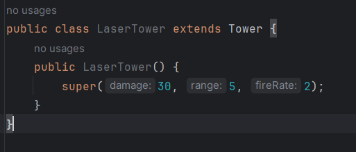

ArrowTower: Torre con bajo daño, alcance moderado y alta velocidad de disparo.

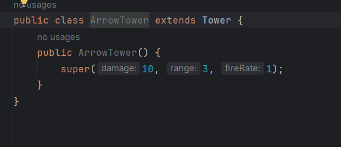

#### Wave: 

Maneja las oleadas de enemigos que llegan al mapa.

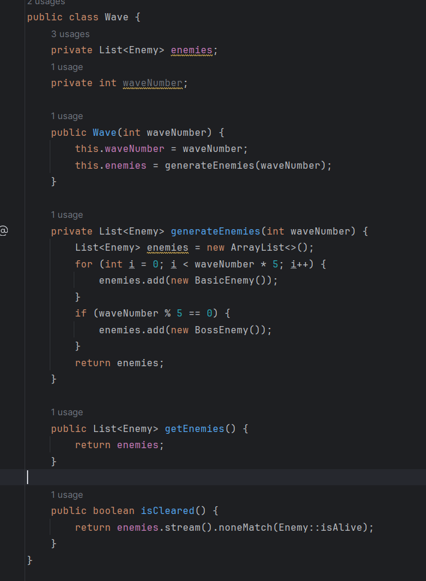

Atributos:

- enemies: Lista de enemigos en la oleada.
- waveNumber: Número de la oleada actual.

Métodos:
- getEnemies(): Devuelve la lista de enemigos.
- isCleared(): Verifica si todos los enemigos han sido derrotados.
- generateEnemies(int waveNumber): Genera una lista de enemigos según el número de la oleada.

#### Player: 

Representa al jugador y gestiona su puntuación y la salud de la base.
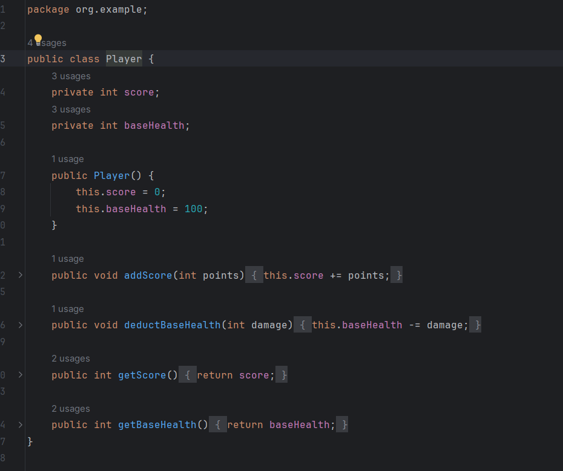

Atributos:

- score: Puntuación del jugador.
- baseHealth: Salud de la base del jugador.

Métodos:
- addScore(int points): Aumenta la puntuación del jugador.
- deductBaseHealth(int damage): Reduce la salud de la base.
- getScore(): Devuelve la puntuación del jugador.
- getBaseHealth(): Devuelve la salud de la base.

#### Game:
   

Clase principal que maneja la lógica del juego.

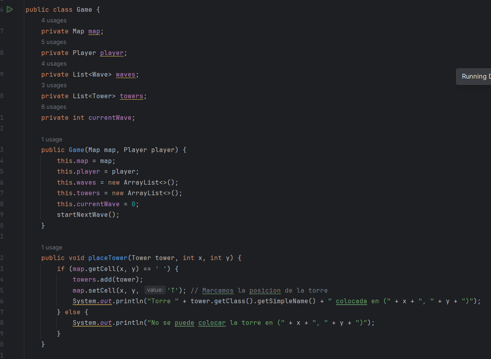
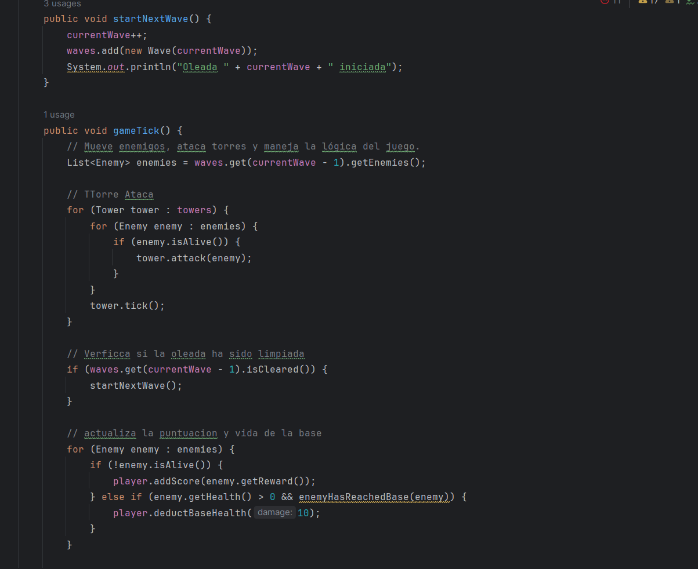
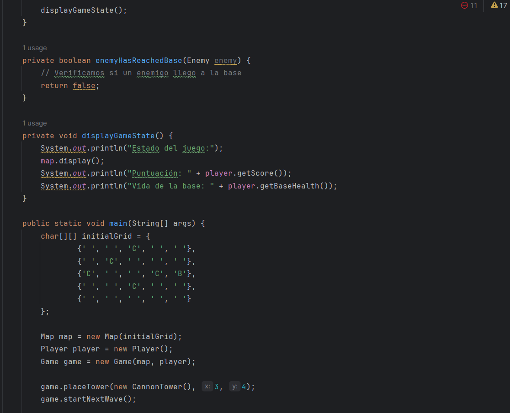
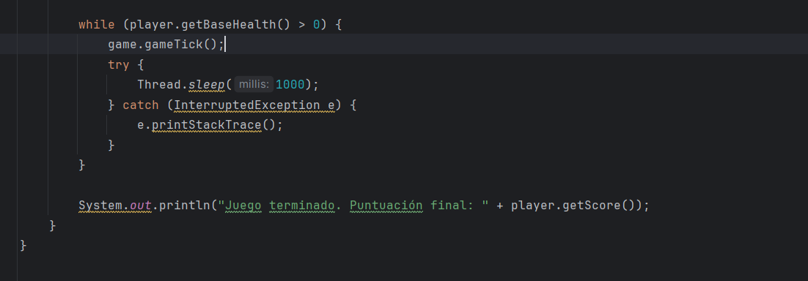

Atributos:

- map: Instancia de la clase Map que representa el escenario del juego.
- player: Instancia de la clase Player que representa al jugador.
- waves: Lista de oleadas de enemigos.
- towers: Lista de torres colocadas en el mapa.
- currentWave: Número de la oleada actual.

Métodos:
- placeTower(Tower tower, int x, int y): Coloca una torre en una posición específica del mapa.
- startNextWave(): Inicia la siguiente oleada de enemigos.
- gameTick(): Maneja la lógica de cada turno del juego, incluyendo el movimiento de enemigos y ataques de las torres.
- displayGameState(): Muestra el estado actual del juego en la consola.
- enemyHasReachedBase(Enemy enemy): Verifica si un enemigo ha llegado a la base.

Verificamos con un ejemplo de entrada y salida:

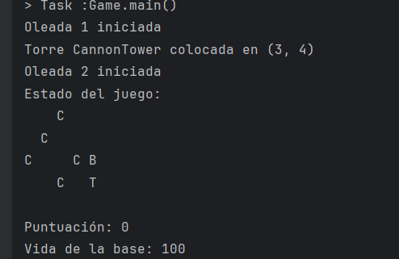

El juego es funcional sin embargo, creo que al no haber.

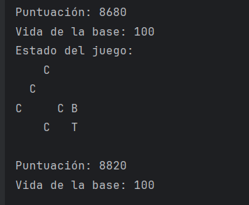

Con esto pasaremos a la parte de pruebas:

### Implementación de pruebas
#### Mocks:

- Utiliza Mockito para crear mocks de las clases Enemy y Tower para verificar la interacción
entre objetos.

Primero agregamos la dependencia para usar mockito al buildgradle de nuestro proyecto: 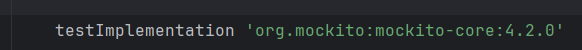

Ahora escribimos la prueba:

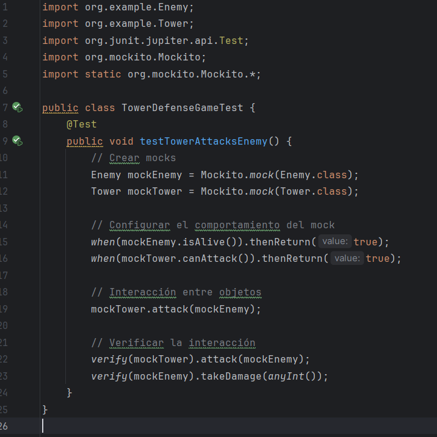

Objetivo: Probar que una torre (mockTower) puede atacar a un enemigo (mockEnemy) cuando el enemigo está vivo y la torre puede atacar.

Se crean mocks para Enemy y Tower utilizando Mockito.

Se define el comportamiento esperado de los mocks:
 - mockEnemy.isAlive() devuelve true.
 - mockTower.canAttack() devuelve true.

Se llama al método attack de la torre con el mock del enemigo.

Para la verificacion: 

Se verifica que la torre efectivamente llamó al método attack con el mock del enemigo.

Se verifica que el enemigo recibió el método takeDamage con cualquier cantidad de daño (anyInt()).

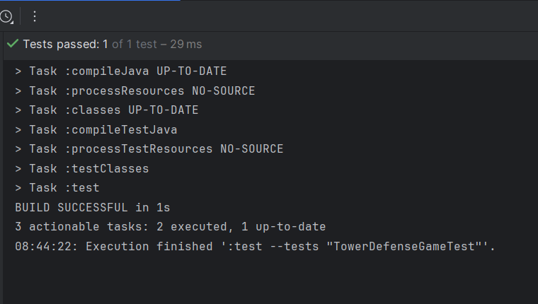

Verificamos que el test pasa correctamente

#### Stubs:
- Crea stubs para métodos que devuelven enemigos o torres específicos.

Nuestro objetivo es probar la generación de enemigos en una oleada (Wave) específica, para ello escribimos el siguiente stub:

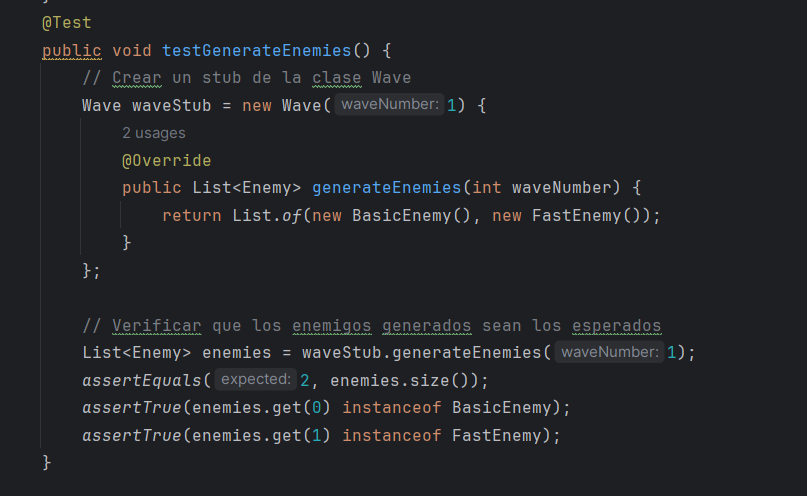

Se crea un stub de la clase abstracta Wave con una implementación anónima.

Se sobrescribe el método generateEnemies para retornar una lista predefinida de enemigos (BasicEnemy y FastEnemy).

Verificación:

Se llama al método generateEnemies del stub waveStub con el número de oleada 1.

Se verifica que la lista de enemigos generada tiene el tamaño esperado (2 enemigos).

Se verifica que los tipos de enemigos generados son BasicEnemy y FastEnemy.

Este test asegura que la generación de enemigos en una oleada específica (Wave) devuelve los tipos y la cantidad esperada de enemigos.

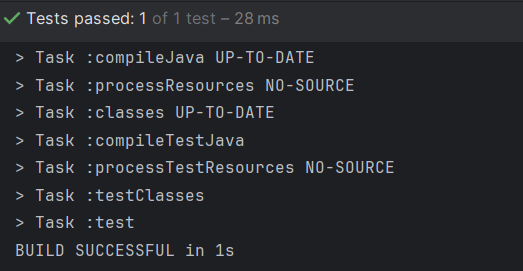

#### Fakes:
- Utilizar fakes para simular la base de datos de puntuación o estados de oleadas.

Primero creo una clase FakeScoreDatabase:

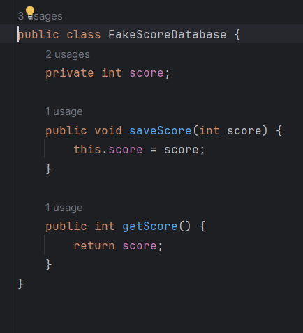

Nuestro objetivo en este caso es probar la funcionalidad básica de un "fake" para simular una base de datos de puntuación (FakeScoreDatabase).

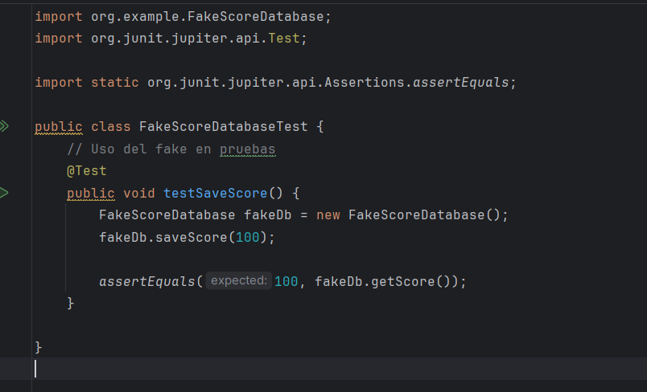

Se instancia un objeto FakeScoreDatabase.

Se llama al método saveScore para guardar una puntuación (100 en este caso).

Verificación:

Se verifica que la puntuación guardada sea la misma que la esperada (100).

Con este test nos aseguramos que el fake FakeScoreDatabase puede guardar correctamente una puntuación y luego recuperarla de manera consistente.

#### Pruebas de mutación:
- Implementa pruebas de mutación para verificar la calidad de las pruebas unitarias.
- ¿Qué herramienta utilizarías para realizar pruebas de mutación en este proyecto, y cómo la
configurarías?

Para las pruebas de mutación, se puede utilizar una herramienta como PIT (Pitest).
Para configurarla añadiremos las dependencias en el buildgradle:
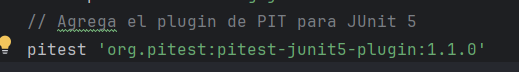

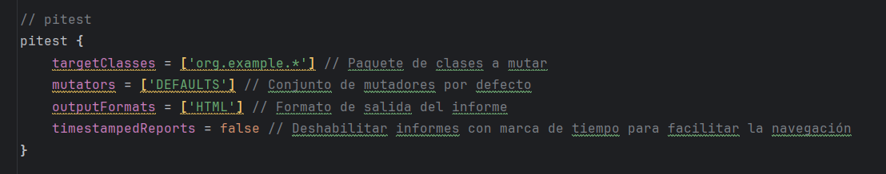

- Configura la herramienta de pruebas de mutación para el proyecto y ejecuta un análisis de
mutación en la clase TowerDefenseGame.

Para ejecutar el analidis de mutacion, escribimos el comando: `./gradlew pitest`
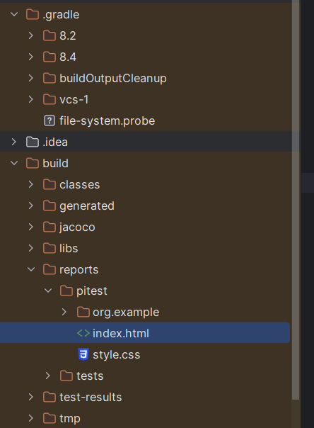

Evaluación de cobertura de pruebas:
- ¿Cómo interpretarías los resultados de las pruebas de mutación y qué acciones tomarías

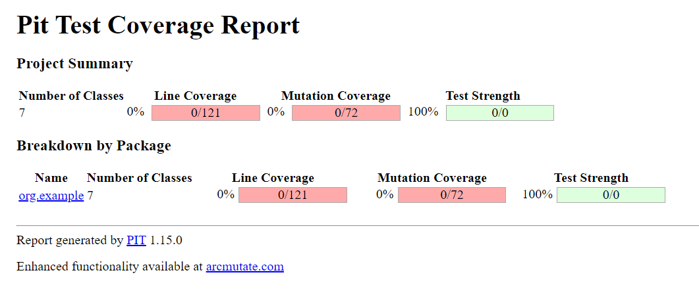

para mejorar la cobertura de las pruebas?
- Implementa mejoras en las pruebas unitarias basándote en los resultados de las pruebas de
mutación y explica las razones de cada cambio.

### Preguntas de diseño e implementación (5 puntos)
#### Diseño de la clase Map:
• ¿Cómo implementarías la clase Map para representar el mapa del juego, asegurando que se
puedan agregar y verificar posiciones de torres y caminos?

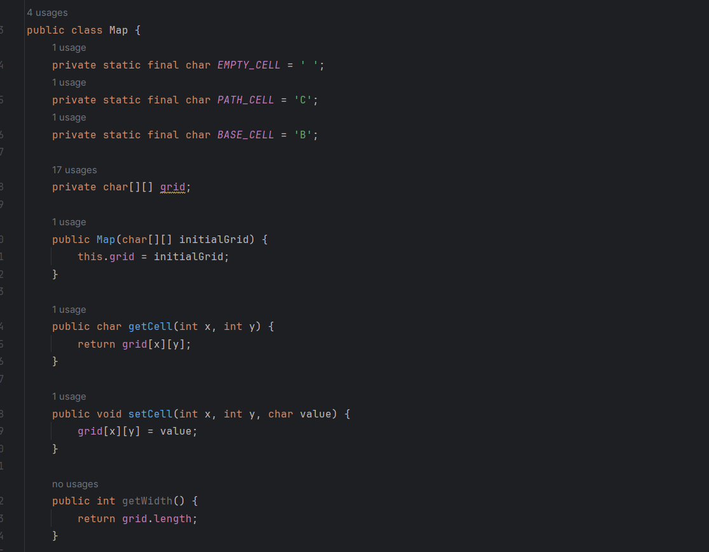
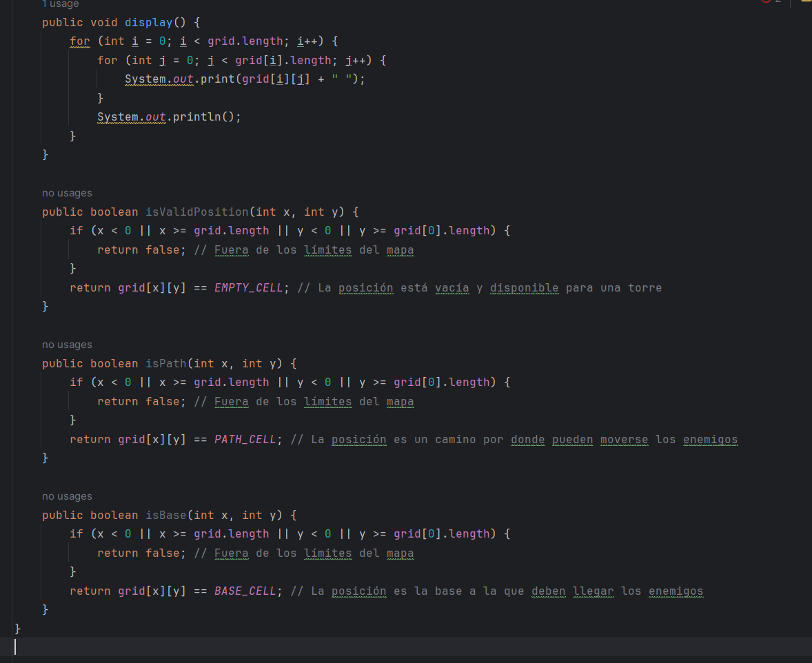

Explicación de los Métodos Agregados:

- Constantes EMPTY_CELL, PATH_CELL, BASE_CELL: Definen los caracteres que representan celdas vacías, caminos y la base respectivamente.

- Método isValidPosition(int x, int y): Verifica si una posición (x, y) es válida para colocar una torre. Comprueba si está dentro de los límites del mapa y si la celda está vacía (EMPTY_CELL).
- Método isPath(int x, int y) y isBase(int x, int y): Verifican si una posición (x, y) es un camino (PATH_CELL) o la base (BASE_CELL), respectivamente.

Con estos cambios , la clase Map ahora puede manejar eficazmente la representación del mapa del juego, plo que permite verificar y gestionar posiciones específicas para torres, caminos y la base. 

• Implementa un método en la clase Map llamado isValidPosition(int x, int y) que verifique si
una posición es válida para colocar una torre.
#### Enemigos con diferentes características:
• Diseña e implementa una clase SpeedyEnemy que herede de Enemy y tenga una velocidad
mayor pero menos vida.

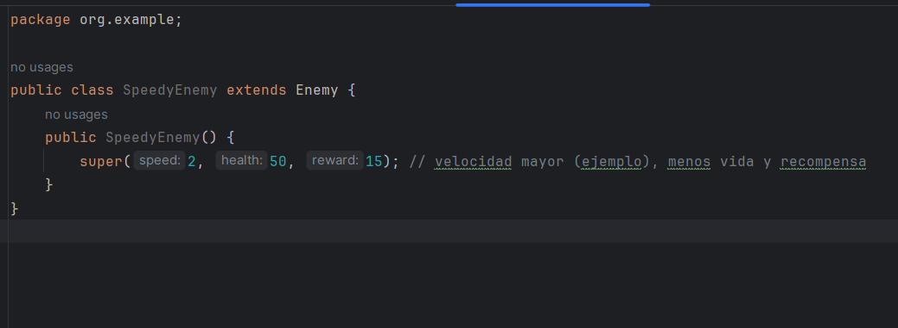

• ¿Cómo gestionarías el movimiento de los enemigos en el mapa, asegurando que sigan el
camino predefinido?

Para gestionar el movimiento de los enemigos y asegurar que sigan el camino predefinido en el mapa, se puede implementar un sistema donde cada enemigo almacene su posición actual en el camino y utilice esta información para determinar hacia dónde moverse en cada turno. Eso se podria relizar de la siguiente manera:

Implementación Básica del Movimiento de los Enemigos
Mapa con Caminos Definidos: Debemos asgurarnos de tener un mapa con caminos definidos como 'C' donde los enemigos puedan moverse.

Clase Enemy con Métodos de Movimiento: Implementamos métodos en la clase Enemy (y sus subclases como SpeedyEnemy) para manejar cómo los enemigos se mueven de una celda a otra a lo largo del camino.

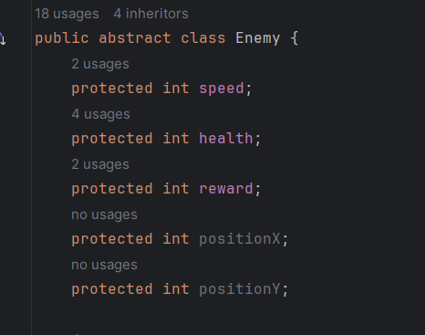
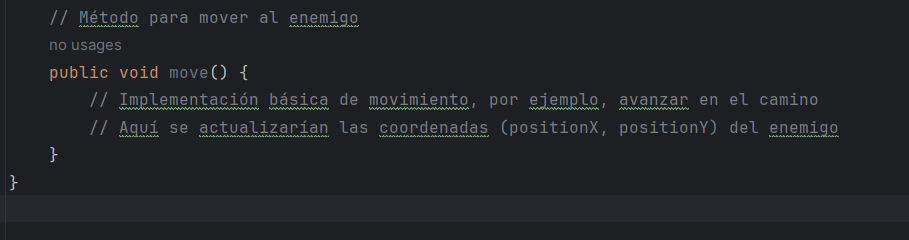

Actualización del Estado del Juego: Después de que cada enemigo se mueva, verifica si ha llegado a la base ('B') o si todavía está en el camino. Esto podría implicar ajustar la posición del enemigo en el mapa y posiblemente aplicar efectos de movimiento (por ejemplo, decrementar la posición actual y avanzar en el siguiente turno).

#### Torres con diferentes habilidades:
• Implementa una clase SniperTower que tenga un daño alto y un alcance muy largo pero una
velocidad de disparo baja.

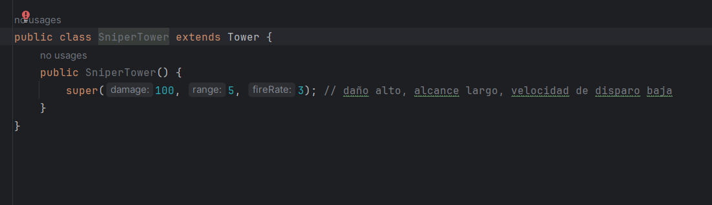

• ¿Cómo implementarías el método attack(List<Enemy> enemies) en la clase Tower para
atacar a los enemigos dentro de su alcance?
#### Sistema de oleadas:
• ¿Cómo diseñarías la generación de oleadas para que cada oleada sea progresivamente más
difícil?

• Implementa un método en la clase Wave llamado spawnEnemies() que genere los enemigos
de la oleada y los coloque en el mapa.
#### Sistema de puntuación y salud de la base:
• ¿Cómo actualizarías la puntuación del jugador y la salud de la base cuando un enemigo es
derrotado o alcanza la base?

• Implementa un método en la clase Player llamado updateScoreAndHealth(Enemy enemy,
boolean defeated).

